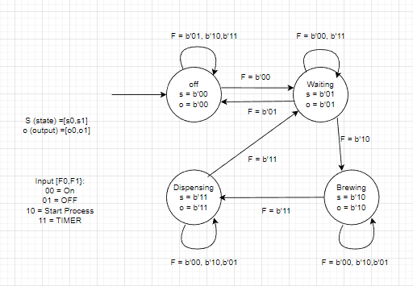
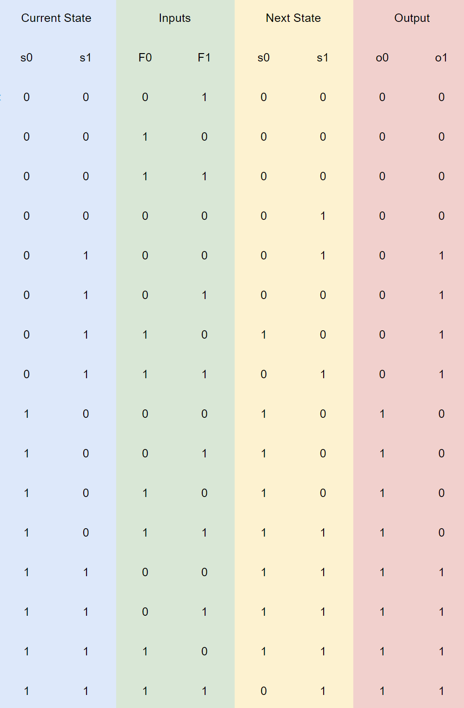
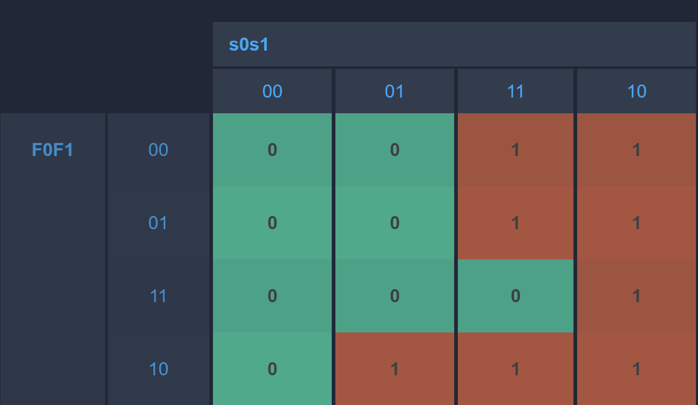
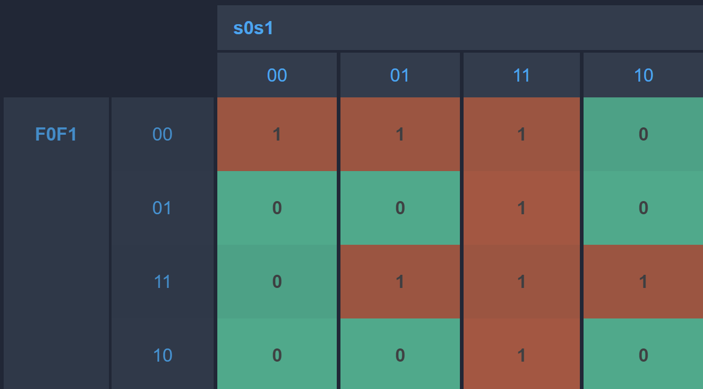
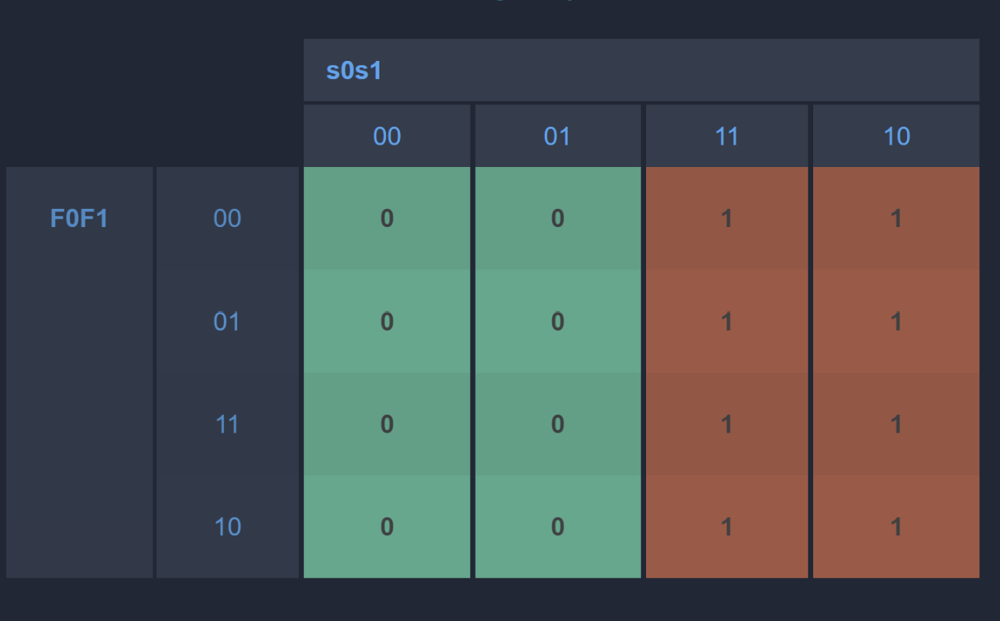
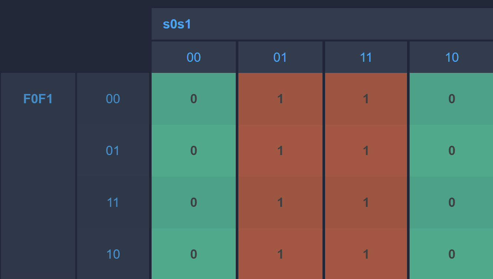
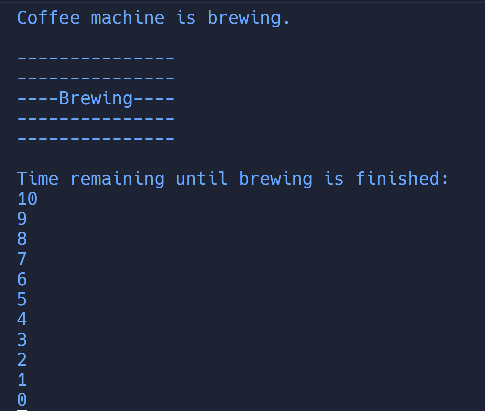
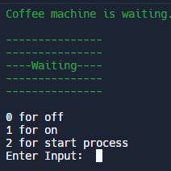

# FSM of a Simple Coffee machine System
### What is an FSM?
A finite state machine is a tool used to design algorithms and computer programs that have a limited number of possible states and transitions between those states. It can be thought of as a flowchart with a set number of boxes representing states, and arrows representing the transitions between those states. 

The machine follows the transitions and takes specific actions based on the state it is in and the input it receives. FSMs are useful for designing programs that need to follow a specific series of steps or respond to inputs in a specific way, such as the elevator system that i  am going to describe below.

### Coffee Machine

The coffee machine system is a simple state machine that allows you to control the behavior of a coffee machine. It has four states: off, waiting, brewing, and dispensing. These states represent the different stages of operation for the coffee machine.

There are also four inputs that the coffee machine can receive: off, on, start process, and timer. These inputs allow you to control the coffee machine by turning it on or off, starting the brewing process, or timer. The coffee machine transitions between these states are based on the input it receives. For example, if the current state is off and the input is on, the coffee machine will transition to the waiting state. If the current state is brewing which is the process of extracting flavors from ground coffee beans by mixing hot water with the beans, it will take 10 seconds, for the process to happen and after 10 seconds, the state wil move to dispensing which is the process of releasing the brewed coffee in which will take 10 second for the dispensing process to finish. If the dispensing process is done, it will directly move back to the waiting state. In the waiting state, the machine then could be turned off if the user is done using the machine.

The transitions could be seen clearly from the transition table:

These are the karnaugh map:

- s0

s0 = s0s1' + s0F0' + s0F1' + s1F0F1'

- s1

s1 = s0s1 + s0'F0'F1' + s1F0F1 + s0F0F1

- o0

o0 = s0

- o1

o1 = s1

## Visualisation
for a clearer understanding of the machine, i have created a code in which works based on the system above.

When the code is ran, the starting state will be off. It will ask for user's input in which there are choices of on, off, start process and timer. If the state is OFF, the color would be white, if the state is in WAITING state, the color is green, if the state is BREWING, the color is blue and if the state is DISPENSING, the color is red.

Example of Brewing state:

Example of Waiting state:

Please be in mind that this is just a simple visualisation of the Coffee Machine system

### To run the code:
make sure to install wsl first

install the code through zip

open the code and run make inside the terminal

## Thank you!

